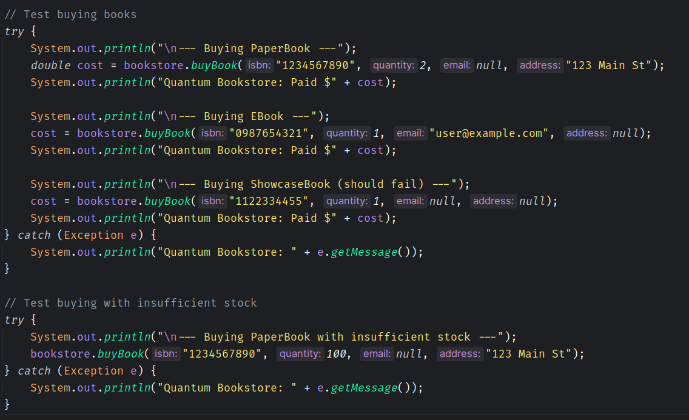
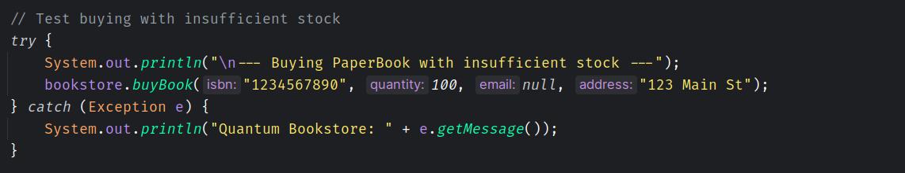
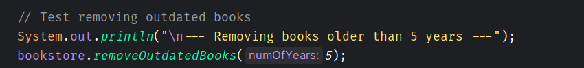

# Quantum Bookstore System

## Overview
The Quantum Bookstore System is a simple Java application designed to manage a bookstore's inventory and facilitate book purchases. Built with Maven, it supports three book types: `PaperBook` (physical books), `EBook` (digital books), and `ShowcaseBook` (non-purchasable display books). The system allows adding books to the inventory, purchasing books with appropriate delivery methods (shipping for physical books, emailing for digital books), and removing outdated books based on their publication year. It adheres to Object-Oriented Programming (OOP) principles, including encapsulation, abstraction, and inheritance, as outlined in the provided OOP guidelines.

## Class Hierarchy
The project is organized into four packages for clear separation of concerns:

```
com.bookstore
├── QuantumBookstoreFullTest.java
├── model
│   ├── Book.java (abstract)
│   ├── EBook.java
│   ├── PaperBook.java
│   ├── ShowcaseBook.java
├── service
│   ├── MailService.java (interface)
│   ├── PurchaseService.java
│   ├── ShippingService.java (interface)
├── service.providers
│   ├── FawryMailService.java
│   ├── FawryShippingService.java
├── system
│   ├── QuantumBookstoreSystem.java
```

### Package Details
- **`com.bookstore`**:
    - `QuantumBookstoreFullTest`: The main test class, demonstrating functionality through test cases for adding, purchasing, and removing books.
- **`com.bookstore.model`**:
    - `Book` (abstract): Base class with attributes (`isbn`, `title`, `author`, `year`, `price`) and an abstract `Buy` method. Uses Lombok for getters and constructor.
    - `PaperBook`: Extends `Book`, adds `stock` and implements `Buy` for physical book purchases.
    - `EBook`: Extends `Book`, adds `filetype` and implements `Buy` for digital book purchases.
    - `ShowcaseBook`: Extends `Book`, represents non-purchasable books with no additional attributes.
- **`com.bookstore.service`**:
    - `MailService` (interface): Defines `sendEmail` for e-book delivery.
    - `ShippingService` (interface): Defines `ship` for physical book delivery.
    - `PurchaseService`: Handles purchase logic for `PaperBook`, `EBook`, and `ShowcaseBook` with overloaded `purchase` methods.
- **`com.bookstore.service.providers`**:
    - `FawryMailService`: Implements `MailService`, simulates emailing e-books.
    - `FawryShippingService`: Implements `ShippingService`, simulates shipping physical books.
- **`com.bookstore.system`**:
    - `QuantumBookstoreSystem`: Manages the inventory and coordinates operations (`addBook`, `buyBook`, `removeOutdatedBooks`).


## Features
- **Add Books**: Add `PaperBook`, `EBook`, or `ShowcaseBook` to the inventory with null input validation.
- **Purchase Books**:
    - `PaperBook`: Validates stock and address, reduces stock, and ships via `FawryShippingService`.
    - `EBook`: Validates email and sends via `FawryMailService`.
    - `ShowcaseBook`: Non-purchasable, throws an `IllegalStateException`.
- **Remove Outdated Books**: Removes books older than a specified number of years (relative to 2025), with negative years validation.
- **Error Handling**:
    - Throws `IllegalArgumentException` for invalid ISBN, quantity, email/address, or null book.
    - Throws `IllegalStateException` for insufficient stock or non-purchasable books.
- **Output**: Console messages are prefixed with "Quantum Bookstore" for consistency.

## Setup Instructions
### Prerequisites
- **Java**: JDK 11 or higher.
- **Maven**: Version 3.6.0 or higher.
- **Lombok**: Required for `Book` class annotations (`@Data`, `@AllArgsConstructor`).
- **IDE**: IntelliJ IDEA, Eclipse, or any Java-compatible IDE with Maven and Lombok support.

### Installation
1. **Clone the Repository**:
   ```bash
   git clone https://github.com/MostafaAbdulazziz/Quantum-Bookstore.git
   cd Quantum-Bookstore
   ```
2. **Install Lombok**:
    - For IntelliJ IDEA: Enable annotation processing (`File > Settings > Build, Execution, Deployment > Compiler > Annotation Processors`).
    - For Eclipse: Install the Lombok plugin (see [Lombok setup](https://projectlombok.org/setup/eclipse)).
3. **Set Up Maven**:
    - Ensure the `pom.xml` includes the Lombok dependency:
      ```xml
      <dependency>
          <groupId>org.projectlombok</groupId>
          <artifactId>lombok</artifactId>
          <version>1.18.34</version>
          <scope>provided</scope>
      </dependency>
      ```
    - If not present, add it to `pom.xml`.
4. **Build the Project**:
   ```bash
   mvn clean install
   ```
5. **Run the Tests**:
    - Open the project in your IDE and run `com.bookstore.QuantumBookstoreFullTest`.
    - Or use Maven:
      ```bash
      mvn test
      ```

## Sample Test Cases




### Expected Output
Running `QuantumBookstoreFullTest` produces:
```
--- Buying PaperBook ---
Quantum Bookstore: Address is required for PaperBook

--- Buying PaperBook with insufficient stock ---
Quantum Bookstore: Insufficient stock for Java Programming

--- Removing books older than 5 years ---
Quantum Bookstore: Removed outdated book Java Programming
Quantum Bookstore: Removed outdated book Rare Manuscript

Process finished with exit code 0

```


## Dependencies
- **Java**: JDK 11 or higher.
- **Maven**: Version 3.6.0 or higher.
- **Lombok**: Version 1.18.34 (for `Book` class annotations).

### Maven Configuration
Ensure the `pom.xml` includes:
```xml
<dependencies>
    <dependency>
        <groupId>org.projectlombok</groupId>
        <artifactId>lombok</artifactId>
        <version>1.18.34</version>
        <scope>provided</scope>
    </dependency>
</dependencies>
```
## Contributing
1. Fork the repository.
2. Create a feature branch (`git checkout -b feature/your-feature`).
3. Commit changes (`git commit -m "Add your feature"`).
4. Push to the branch (`git push origin feature/your-feature`).
5. Open a pull request.

## License
This project is licensed under the MIT License.
